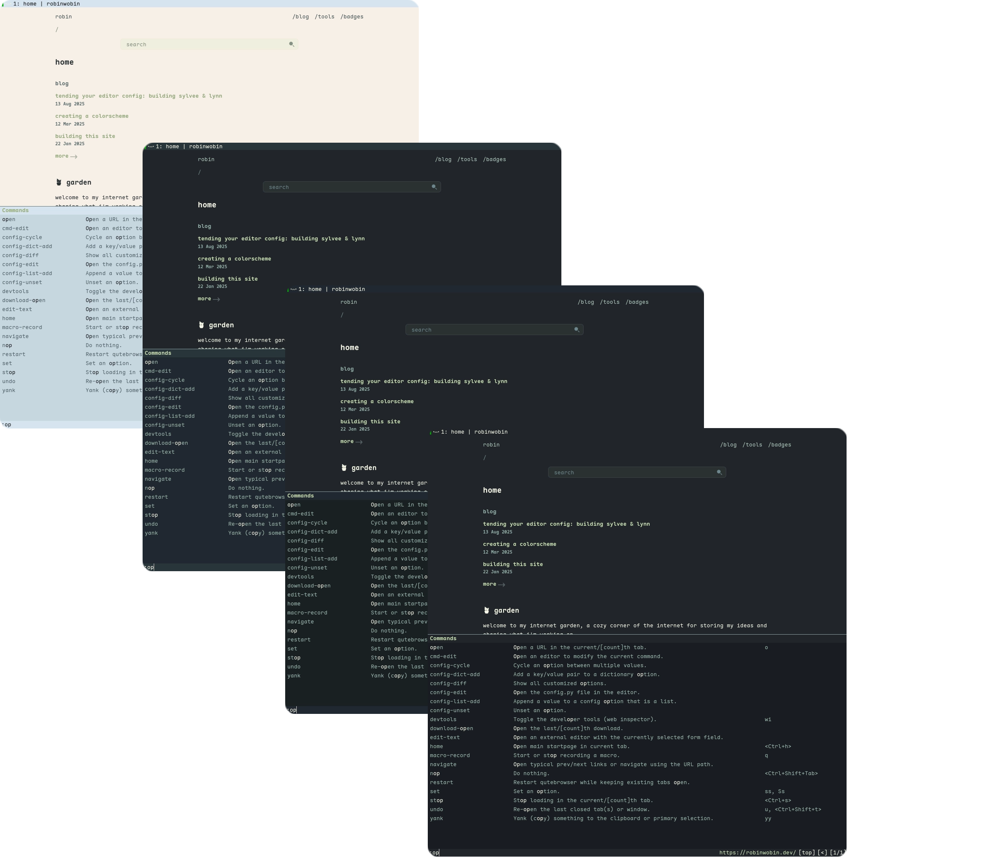
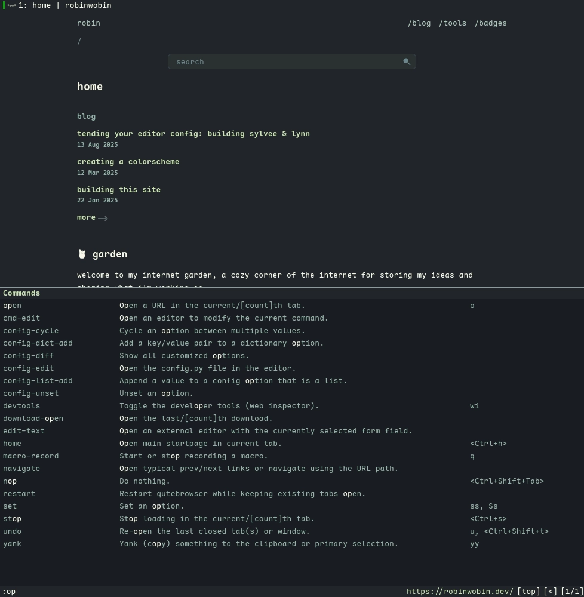
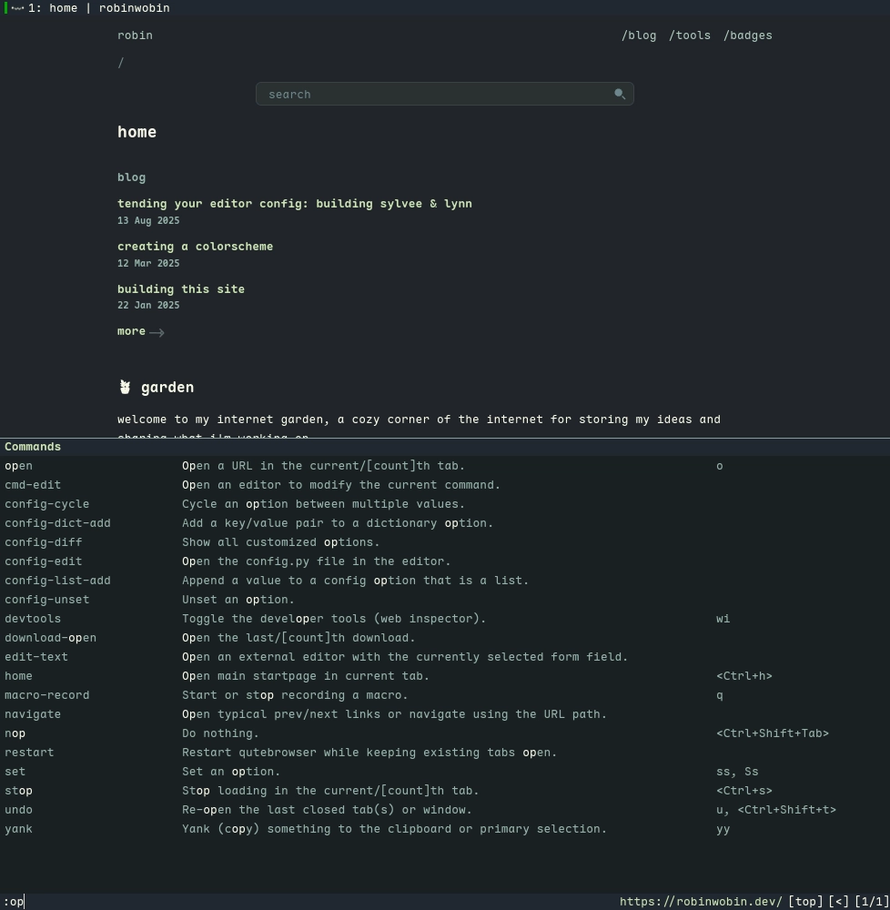
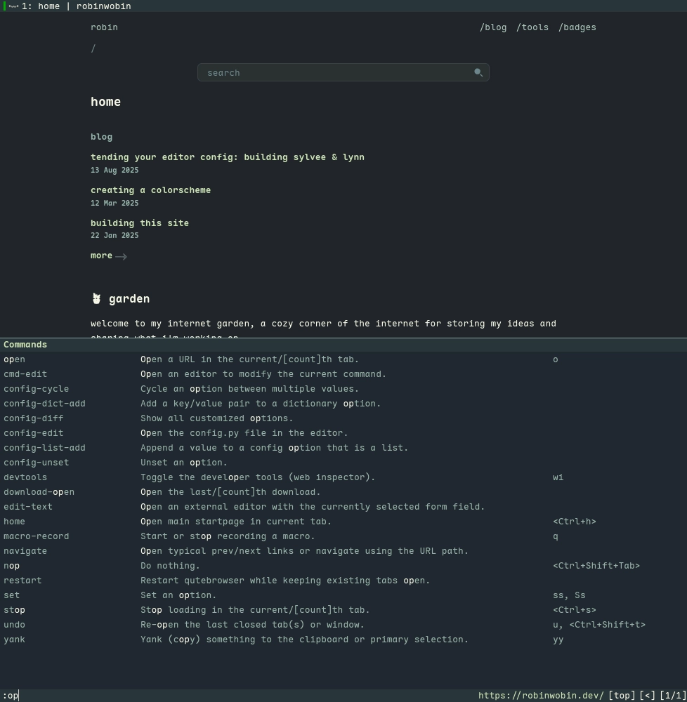
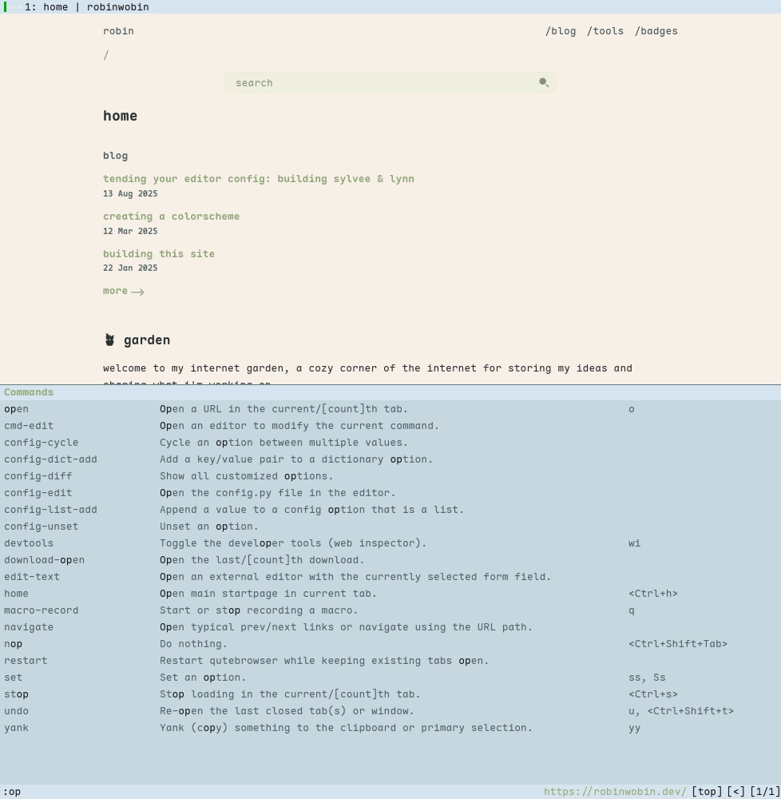

<h3 align="center">
  <br/>
	Evergarden for <a href="https://www.qutebrowser.org/">qutebrowser</a>
</h3>

<p align="center">
  <a href="https://codeberg.org/evergarden/qutebrowser/stars">
    
  </a>
  <a href="https://codeberg.org/evergarden/qutebrowser/issues">
    
  </a>
  <a href="https://codeberg.org/evergarden/qutebrowser/activity/contributors">
    
  </a>
</p>

<p align="center">
  
</p>

### Previews

<details>
  <summary>Winter</summary>
  
</details>
<details>
  <summary>Fall</summary>
  
</details>
<details>
  <summary>Spring</summary>
  
</details>
<details>
  <summary>Summer</summary>
  
</details>

### Usage

1. download this repo as `~/.config/qutebrowser/evergarden/`.
1. add the following to your `config.py`:

```python
import evergarden

config.load_autoconfig()

evergarden.setup(c, 'fall', True)
```

### Thanks to <3

- [catppuccin](https://github.com/catppuccin/qutebrowser)
- [comfysage](https://codeberg.org/comfysage)

<hr>

<p align="center">
  <a href="https://codeberg.org/evergarden/qutebrowser/src/COPYING">
    
  </a>
</p>
